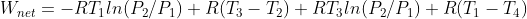
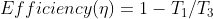
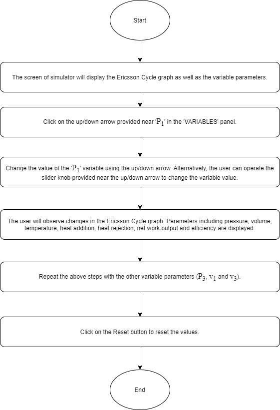
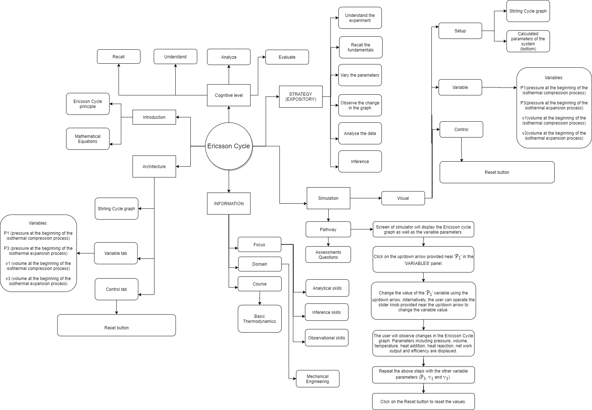
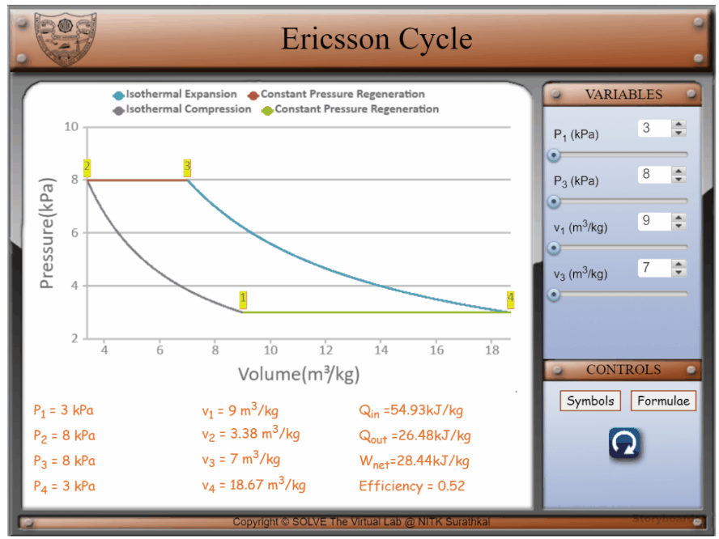

## Storyboard (Round 2)

Experiment: Ericsson Cycle

**1. Story Outline**:

The ideal Ericsson cycle is a reversible thermodynamic cycle. It differs from the Carnot cycle in that the two isentropic processes are replaced by two constant-pressure regeneration processes.

The idealized Ericsson cycle consists of four thermodynamic processes acting on the working fluid:
1-2 Isothermal compression.
2-3 Constant pressure regeneration (internal heat transfer from the working fluid to the regenerator)
3-4 Isothermal expansion.
4-1 Constant pressure regeneration (internal heat transfer from the regenerator back to the working fluid)

In this experiment, the Ericsson cycle is demonstrated so that the user can understand how the P-V graph changes as various pressure and volume parameters change. The heat addition, heat rejection, net work output, as well as efficiency of the cycle is calculated and displayed.

 **2. Story**:

  **2.1 Set the visual stage description**:

The experiment consists of the P-v graph of Ericsson cycle, shown in the main window. All the buttons and the parameters control are on the right side of the frame. The variable panel contains sliders for pressures P1 and P3, and volumes v1 and v3.
The setup consists of a graph that depicts the Ericsson cycle. A legend at the top indicates the processes involved in each of the curves.
By changing the various parameters, the P-V graph changes. By changing the parameters, like P1, the pressure at the beginning of the isothermal compression process changes. Similarly, when changing v3, the volume at the beginning of the isothermal expansion process changes. Similar results follow when other parameters are changed.

  **2.2 Set User Objectives & Goals**:

* Understand the various processes involved in the Ericsson cycle.
* Calculate P2, P4, v2 and v4.
* Calculate the Qin (heat added), Qout (heat rejected) and Wnet (Net work output).
* Calculate the efficiency of the Ericsson cycle.
* Analyze the effect of change in parameters (P1, P3, v1, v3 ) on Qin (heat added), Qout(heat rejected), Wnet (Net work output), and efficiency of the Ericsson cycle.
* Visualise the change in the P-v graph as the parameters(P1, P3, v1, v3) are changed.

  **2.3 Set the pathway activities**:

1. The initial value of P1 (pressure at the beginning of the isothermal compression process) is taken as 3 kPa.
2. The initial value of P3 (pressure at the beginning of the isothermal expansion process) is taken as 8 kPa.
3. The initial value of v1 (volume at the beginning of the isothermal compression process) is taken as 9 m3/kg.
4. The initial value of v3 (volume at the beginning of the isothermal expansion process) is taken as 7 m3/kg.
5. P1 is varied from 3 to 4 kPa using a slider.
6. P3 is varied from 8 to 11 kPa using a slider.
7. v1 is varied from 9 to 11 m3/kg using a slider.
8. v3 is varied from 7 to 11 m3/kg using a slider.
9. Change the parameters of the system to understand the behaviour of the Ericsson cycle.

  **2.4 Set Challenges and Questions/Complexity/variation**

  **2.4.a Questions before simulation**:

  1. Does the Ericsson cycle utilize regeneration?

    <ol type="a">
   <li>Yes</li>
   <li>No</li>
   </ol>

   Answer: a

  2. When operating between the same temperature limits, the thermal efficiency of Ericsson cycle is

  <ol type="a">
  <li>Greater than that of Carnot cycle</li>
  <li>Equal to that of Carnot cycle</li>
  <li>Lesser than that of Carnot cycle</li>
  </ol>

  Answer: b

  3. The ideal Ericsson cycle is:

  <ol type="a">
  <li>Totally reversible</li>
  <li>Internally reversible</li>
  <li>Both of the above</li>
  <li>None of the above</li>
  </ol>

  Answer: a

  4. Consider the ideal otto, ericsson and carnot cycles operating between the same temperature limits. Which of the following is correct?

   <ol type="a">
  <li>Efficiency of otto cycle < Efficiency of carnot cycle = Efficiency of ericsson cycle</li>
  <li>Efficiency of otto cycle > Efficiency of carnot cycle = Efficiency of ericsson cycle</li>
  <li>Efficiency of otto cycle = Efficiency of carnot cycle = Efficiency of ericsson cycle</li>
  <li>Efficiency of otto cycle = Efficiency of carnot cycle > Efficiency of ericsson cycle</li>
  </ol>

  Answer: a

  5. Given that a Ericsson cycle is operating between the temperature limits of 2000K and 300K, what is its efficiency?

   <ol type="a">
  <li>0.98</li>
  <li>0.85</li>
  <li>5.66</li>
  <li>0.56</li>
  </ol>

  Answer: b

  6. Is the Ericsson engine an external combustion engine?

   <ol type="a">
  <li>Yes</li>
  <li>No</li>
  </ol>

  Answer: a

**2.4.b Questions after simulation**

1. “Ericsson cycle is difficult to achieve in practice because it involves heat transfer through a differential temperature difference in all components including the regenerator”. Indicate whether this statement is

<ol type="a">
<li> True</li>
<li> False</li>
</ol>
Answer: a

2. The Ericsson cycle consists of

<ol type="a">
<li> Two isothermal and two constant pressure processes</li>
<li> Two isentropic and two constant pressure processes</li>
<li> One isothermal, one isentropic and two constant pressure processes</li>
<li> None of the above</li>
</ol>

Answer: a

3. In an Ericsson cycle, heat addition and rejection does not take place at constant temperature.

<ol type="a">
<li>True</li>
<li>False</li>
</ol>

Answer: b

4. In an Ericsson cycle, expansion and compression takes place at

<ol type="a">
<li>Constant pressure</li>
<li>Constant temperature</li>
<li>All of the above</li>
<li>None of the above</li>

Answer: c

5. Given that a Ericsson cycle is operating between the temperature limits of 1200K and 300K, what is its efficiency?

<ol type="a">
<li>0.57</li>
<li>0.75</li>
<li>3</li>
<li>None of the above</li>

Answer: b

6. For ideal Ericsson cycle, given: P1=3 kPa, P3=8 kPa, v1=9 m3/kg, v3=7 m3/kg. Calculate P2, P4, v2, v4.

<ol type="a">
<li>P2= 8 kPa, P4=3 kPa, v2=3.38 m3/kg, v4=18.67 m3/kg</li>
<li>P2= 3 kPa, P4=8 kPa, v2=7 m3/kg, v4=9 m3/kg</li>
<li>P2= 12.25 kPa, P4=10.70 kPa, v2=9.45 m3/kg, v4=6.78 m3/kg</li>
<li>None of the above</li>

Answer: a

7. For ideal Ericsson cycle, given: P1=3 kPa, P3=8 kPa, v1=9 m3/kg, v3=7 m3/kg. Calculate Qin (heat added), Qout (heat rejected) and Wnet (Net work).

<ol type="a">
<li>Qin = 26.48 kJ/kg, Qout =54.93 kJ/kg, Wnet =26.48 kJ/kg</li>
<li>Qin = 28.44 kJ/kg, Qout =54.93 kJ/kg, Wnet =26.48 kJ/kg</li>
<li>Qin = 54.93 kJ/kg, Qout =26.48 kJ/kg, Wnet =28.44 kJ/kg</li>
<li>None of the above</li>

Answer: c

**2.5 Allow pitfalls: NA**

**2.6 Conclusion**:

The time required to perform the virtual experiment.

Time required to perform the virtual experiment.
The approximate time required to understand the procedure to perform the experiment would
take about 5 min. The time needed to understand the graph due to the change in various parameters would be about 5 min.
Thus, the total time required to perform the experiment will be around 10 min.

**2.7a Abbreviations:**

1. Process 1-2 = Isothermal Compression
2. Process 2-3 = Constant Pressure Regeneration (internal heat transfer from the working
fluid to the regenerator)
3. Process 3-4 = Isothermal Expansion
4. Process 4-1 = Constant Pressure Regeneration (internal heat transfer from the
regenerator back to the working fluid)

5. P1, v1, T1 = Pressure, volume and temperature values at the beginning of Process 1-2
6. P2, v2, T2 = Pressure, volume and temperature values at the beginning of Process 2-3
7. P3, v3, T3 = Pressure, volume and temperature values at the beginning of Process 3-4
8. P4, v4, T4 = Pressure, volume and temperature values at the beginning of Process 4-1
9. Qin = Heat addition from external source
10. Qout = Heat rejection to external sink
11. Wnet = Net work output
12. R (Gas constant of air) = 0.287 kJ/kg.K
13. Cp (Specific heat of air at constant pressure) = 1.005 kJ/kg.K
14. Cv (Specific heat of air at constant volume) = 0.718 kJ/kg.K
Efficiency (╖) = Efficiency of Ericsson Cycle

**2.7b Equations/formulae:**

 

 

 

 

 

 

 

 

 

<!-- # Below are the examples added for reference.
# To get mathematical equatios in html format: go to link: https://www.codecogs.com/latex/eqneditor.php and download equations in png format
# In the same link you have option to download equation as punching

### using png -->
<!--
//markdown syntax -->

<!-- //html syntax

 -->

**3. Flowchart**:

**4. Mindmap**:

**5. storyboard**:
1. In the simulation window, the Ericsson cycle graph is displayed.
2. The various symbols and the formulae involved in the experiment are displayed in the control panel when the cursor hovers over ‘Symbols’ and ‘Formulae’ respectively.
3. The parameters of the system can be changed by changing the variables as shown.
4. Move the knob of the sliders to vary the pressures P1 and P3, the volumes v1 and v3. P1 can be varied from 3 to 4 kPa. P3 can be varied from 8 to 11 kPa. v1 can be varied from 9 to 11 m3/kg. v3 can be varied from 7 to 11 m3/kg
5. P1, P2, P3, P4, v1, v2, v3, v4, Qin, Qout, Wnet and the efficiency are displayed at the bottom.
6. Visualize the change in the graph as the various parameters are changed.

**6. References**:

Basic and Applied Thermodynamics - P.K. Nag
Thermodynamics: An Engineering Approach - Yunus A Cengel, Michael A Boles
https://extrudesign.com/ericsson-cycle/
https://clubtechnical.com/ericsson-cycle
